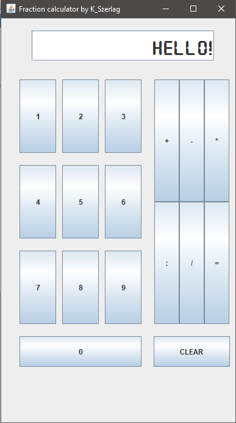

## FRACTION CALCULATOR

The main goal of this project was creating application allowing to calculate result of mathematical
expression which contains fraction.
 
As a result, an application based on the mvc model was created using swing library for implementing view. 
 

